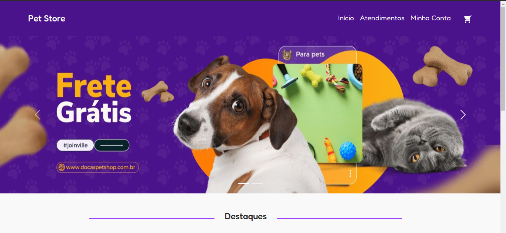
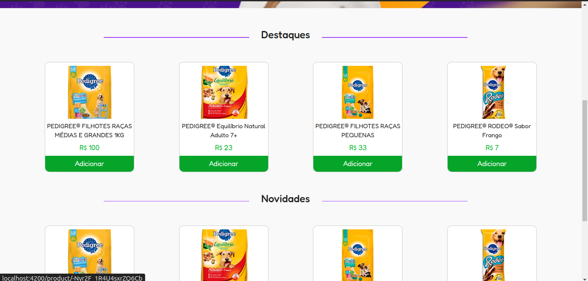
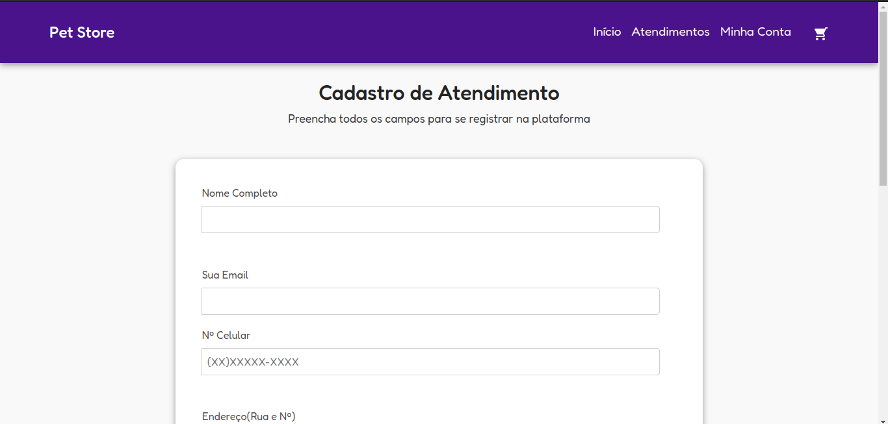
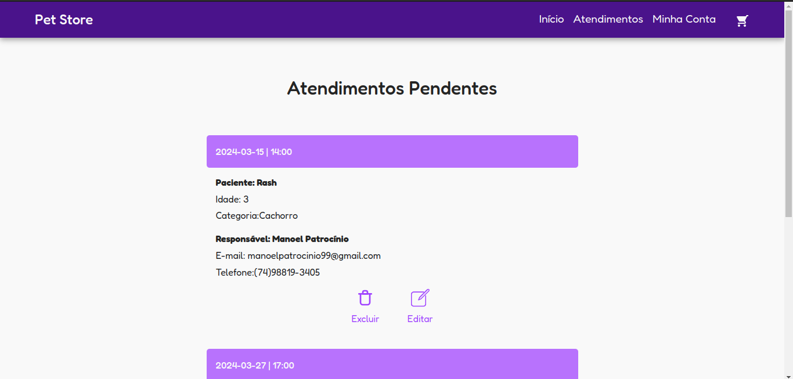
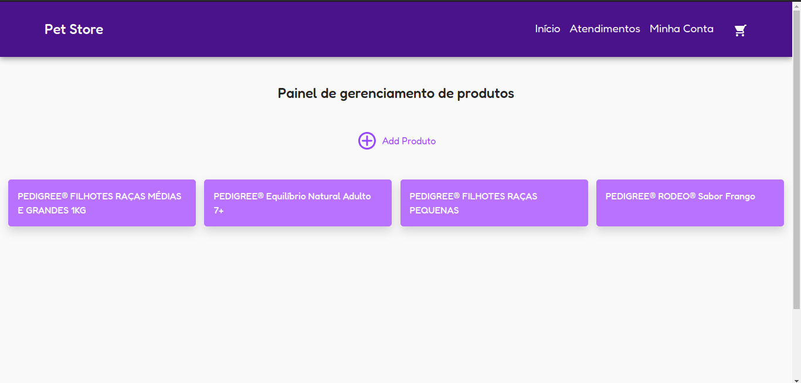
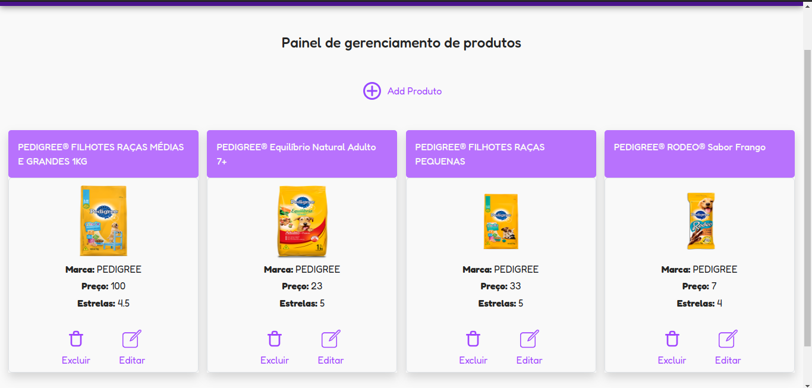
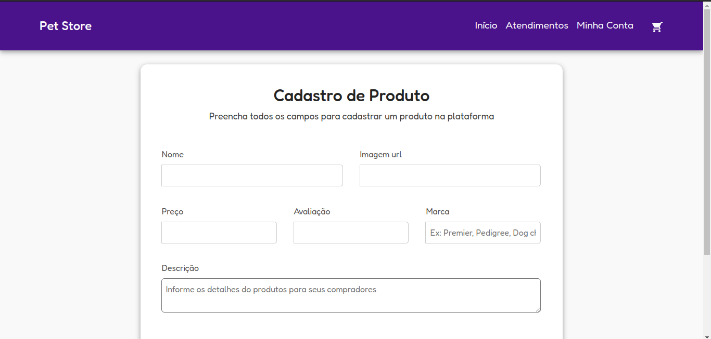
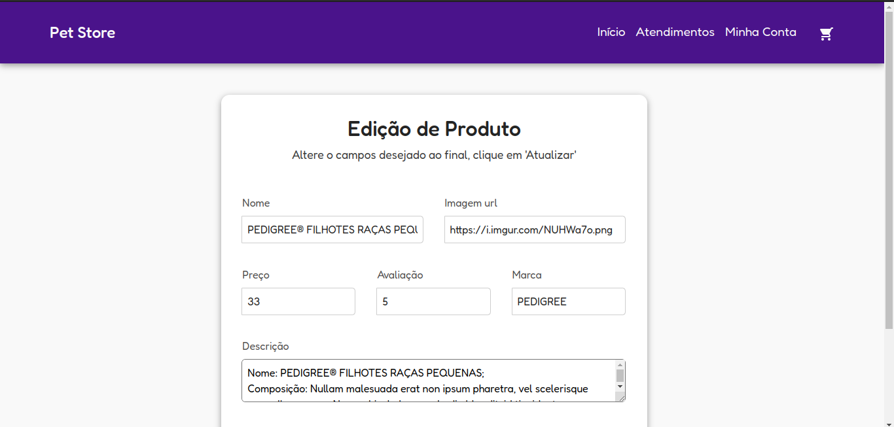
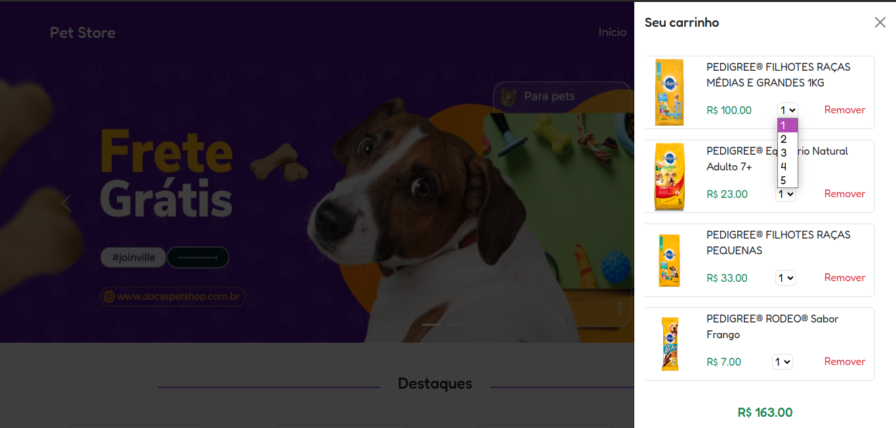

## LICENSE!

[](https://github.com/ManoelPatrocinio/Trilha_FrontEnd/edit/mainLICENSE)

## 💻 Sobre o projeto

O projeto consiste em uma aplicação para a loja virtual chamada PetStore, contendo gerenciamento de atendimentos e produtos.

[Confira o projeto]( https://petstore01.netlify.app/) 


## TECNOLOGIAS USADAS

* Angular 17
* JavaScript/Typescript
* Firebase
* Bootstrap
      


## 🎨 Páginas da aplicação

### Pagina Home(principal)

<p align="center" style="display: flex; align-items: flex-start; justify-content: space-between;">


</p>


### Pagina Atendimento

<p align="center" style="display: flex; align-items: flex-start; justify-content: space-between;">


</p>

### Pagina Painel Admin

<p align="center" style="display: flex; align-items: flex-start; justify-content: space-between;">


</p>

### Pagina Painel Admin/ Produto

<p align="center" style="display: flex; align-items: flex-start; justify-content: space-between;">


</p>

### Carrinho

<p align="center" style="display: flex; align-items: flex-start; justify-content: space-between;">

</p>


### Pré-requisitos

Antes de começar, você vai precisar ter instalado em sua máquina as seguintes ferramentas:
[Git](https://git-scm.com), e ReactJS
Além disto, é bom ter um editor para trabalhar com o código como [VSCode](https://code.visualstudio.com/)

### 🎲 Rodando o Projeto

```bash
# Clone este repositório
$ git clone <https://github.com/ManoelPatrocinio/Trilha_FrontEnd>


# Acesse a branch petstore
$ git checkout petstore

# Instale as dependências iniciais
$ npm install
# Execute a aplicação
$ ng s -o

# O servidor inciará na porta:4200 - acesse <http://localhost:4200>
```

### Dados para acesso

  - Email: manoelpatrocinio99@gmail.com
  - Senha: Manoel@99

### Autores

Albert <span> : </span> [](https://github.com/Albertinesilva)

Nairan Santos <span> : </span> [](https://www.linkedin.com/in/nairansantos/) 


Luis Eduardo <span> : </span> [](https://www.linkedin.com/in/eduardsroch/) 

Manoel Patrocínio <span> : </span> [](https://linkedin.com/in/manoel-patrocinio) 
